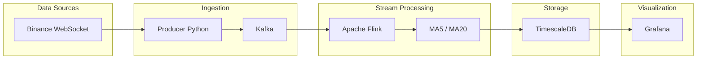
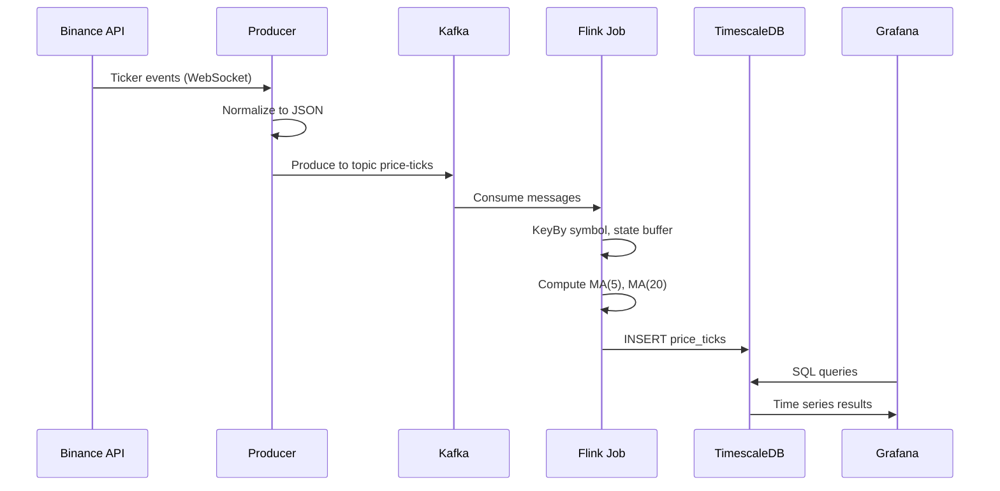
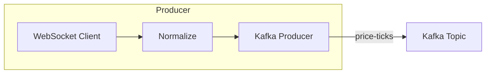
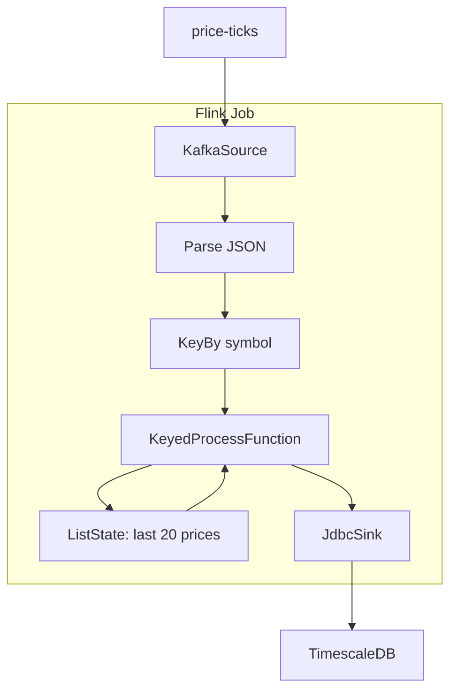
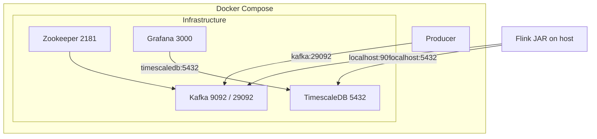

# System Architecture — Real-time Crypto Pipeline

This document describes the architecture of the real-time price pipeline: from Binance WebSocket through Kafka, Flink, TimescaleDB, and Grafana.

---

## 1. Overview

The system ingests live price data from Binance, streams it through Kafka, computes Moving Averages (MA5, MA20) in Flink, stores time-series in TimescaleDB, and visualizes in Grafana.



**End-to-end:** Binance → Producer → Kafka (`price-ticks`) → Flink (MA) → TimescaleDB → Grafana.

---

## 2. Data Flow



| Step | Description |
|------|-------------|
| 1 | **Producer** connects to Binance WebSocket (combined stream), receives 24h ticker events. |
| 2 | Producer normalizes each event to `{ symbol, timestamp, price, volume }` and publishes to Kafka topic `price-ticks`. |
| 3 | **Flink job** consumes `price-ticks`, keys by symbol, keeps last 20 prices in state, computes MA(5) and MA(20), emits `PriceWithMA`. |
| 4 | Flink writes to TimescaleDB table `price_ticks` (time, symbol, price, volume, ma_short, ma_long). |
| 5 | **Grafana** queries TimescaleDB and displays price, MAs, and volume by symbol and time range. |

---

## 3. Component Details

### 3.1 Data source — Binance

| Item | Description |
|------|-------------|
| **API** | Binance WebSocket, combined stream: `wss://stream.binance.com:9443/ws/<symbol>@ticker/...` |
| **Events** | 24h ticker: current price (`c`), volume (`v`), event time (`E`). |
| **Producer behaviour** | Auto-reconnect on disconnect; configurable symbols via `SYMBOLS` (e.g. btcusdt, ethusdt, …). |

### 3.2 Ingestion — Producer + Kafka



- **Producer** (Python): `websocket-client`, `confluent-kafka`. Connects to Binance, normalizes, publishes to Kafka. Runs in Docker or on host.
- **Kafka**: Topic `price-ticks`, auto-created. Used as single source for the Flink job.

### 3.3 Stream processing — Flink



- **KafkaSource**: Reads `price-ticks`, JSON → `PriceTick`.
- **KeyedProcessFunction**: Per symbol, ListState of last 20 prices; on each event updates state, computes MA(5), MA(20), emits `PriceWithMA`.
- **JdbcSink**: Inserts into `price_ticks` (time, symbol, price, volume, ma_short, ma_long).

### 3.4 Storage — TimescaleDB

- **Table**: `price_ticks` — hypertable partitioned by `time`.
- **Index**: `(symbol, time DESC)` for symbol + time range queries.
- **Protocol**: PostgreSQL; Flink uses JDBC.

### 3.5 Visualization — Grafana

- **Datasource**: PostgreSQL (TimescaleDB).
- **Dashboard**: Time series (price, MA5, MA20), volume, symbol selector; queries use `symbol = '$symbol'` and time range.

---

## 4. Deployment (Docker Compose)



| Service | Port | Role |
|---------|------|------|
| Zookeeper | 2181 | Kafka coordination |
| Kafka | 9092 (host), 29092 (internal) | Broker; topic `price-ticks` |
| TimescaleDB | 5432 | Database `pipeline`, user `pipeline` |
| Grafana | 3000 | Dashboard UI (admin / admin) |
| Producer | — | Container; Binance → Kafka |

Flink job is built and run on the host (or separate runner), with `KAFKA_BOOTSTRAP=localhost:9092` and `JDBC_URL=jdbc:postgresql://localhost:5432/pipeline`.

---

## 5. Repository Layout

```
project/
├── docker-compose.yml       # Zookeeper, Kafka, TimescaleDB, Grafana, Producer
├── producer/                # Binance WebSocket → Kafka
│   ├── Dockerfile
│   ├── requirements.txt
│   └── src/
│       ├── main.py
│       ├── fetcher/          # binance_ws.py (reconnect logic)
│       └── publisher/       # kafka_publisher.py
├── stream-processor/        # Flink: Kafka → MA → TimescaleDB
│   ├── pom.xml
│   └── src/main/java/com/pipeline/jobs/
│       ├── MovingAverageJob.java
│       ├── MovingAverageFunction.java
│       ├── PriceTick.java
│       └── PriceWithMA.java
├── storage/init/
│   └── 01_schema.sql        # Hypertable, index
├── grafana/provisioning/
│   ├── datasources/         # TimescaleDB datasource
│   └── dashboards/          # Dashboard JSON
├── ARCHITECTURE.md
└── README.md
```

---

## 6. Technology Stack

| Layer | Technology |
|-------|------------|
| Source | Binance WebSocket API |
| Ingestion | Apache Kafka (topic `price-ticks`) |
| Processing | Apache Flink 1.18 (KafkaSource, KeyedProcessFunction, JdbcSink) |
| Storage | TimescaleDB (PostgreSQL + hypertable) |
| Visualization | Grafana (PostgreSQL datasource) |
| Producer | Python 3 (websocket-client, confluent-kafka) |
| Flink | Java 17, Maven |

---

## 7. Possible Extensions

- **More sources**: Other exchanges or REST/WebSocket feeds (e.g. CoinGecko, Yahoo Finance) via extra producers or topics.
- **Flink**: Higher parallelism; more indicators (RSI, Bollinger) in the same or a new job.
- **TimescaleDB**: Continuous aggregates for OHLCV by minute/hour.
- **Grafana**: Alerts on price or MA cross, or threshold breaches.
