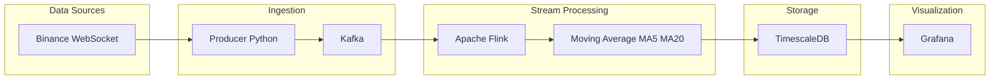
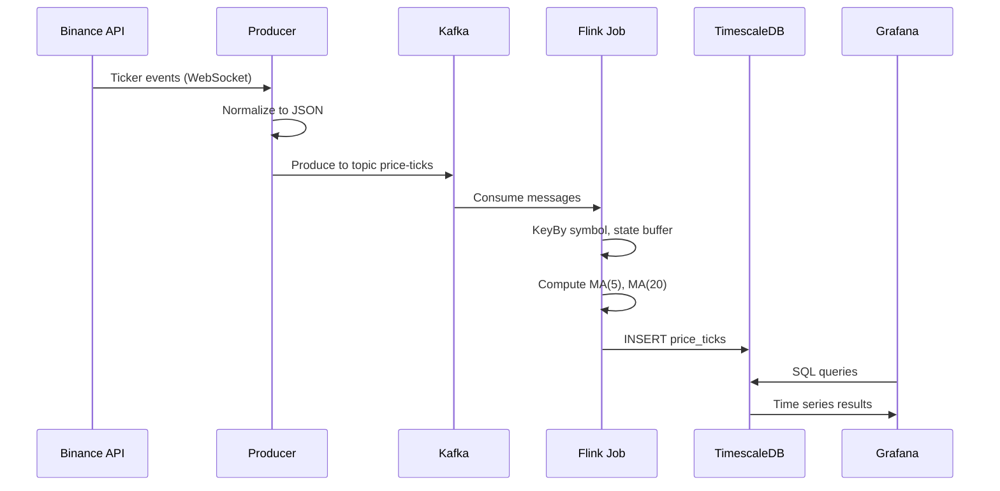
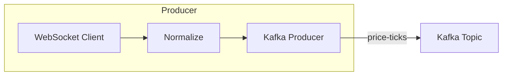
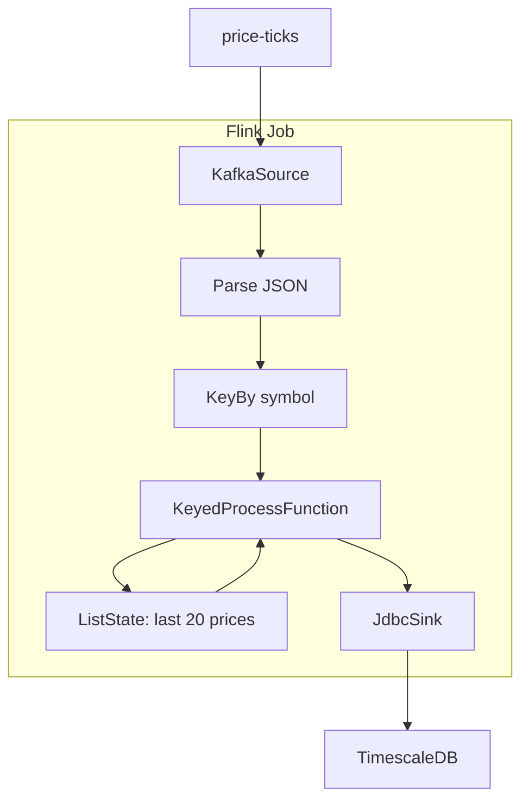
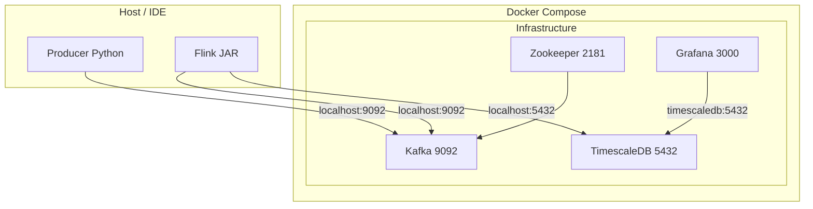
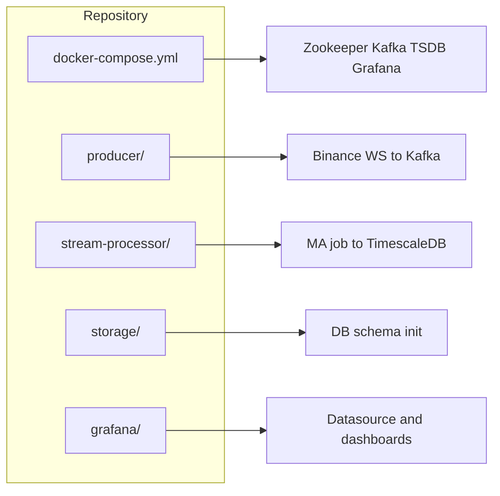

# System architecture — Real-time Crypto/Stock Pipeline

## 1. Overview

The system processes real-time price data: ingest from the exchange, push to a message queue, compute indicators (Moving Average) on the stream, store time-series data, and display on a dashboard.

---

## 2. Data flow

---

## 3. Layer details

### 3.1 Data source

| Component | Description |
|-----------|-------------|
| **Binance WebSocket** | 24h ticker stream (`/ws/<symbol>@ticker`). Each event has current price (c), volume (v), time (E). |
| **Output format** | Producer normalizes to `{ symbol, timestamp (ISO), price, volume }`. |

### 3.2 Ingestion

- **Producer** (Python): Connects to Binance WebSocket, receives ticks → normalizes → publishes to Kafka.
- **Kafka**: Topic `price-ticks`, partition key = symbol. Supports multiple consumers, replay, and independent scaling of producer/consumer.

### 3.3 Stream processing (Flink)

- **KafkaSource**: Reads `price-ticks`, deserializes JSON to `PriceTick`.
- **KeyedProcessFunction**: For each key (symbol), keeps ListState of the last 20 prices; on each event updates state, computes MA(5) and MA(20), emits `PriceWithMA`.
- **JdbcSink**: Writes directly to table `price_ticks` (time, symbol, price, volume, ma_short, ma_long).

### 3.4 Storage (TimescaleDB)

- **Table**: `price_ticks` — hypertable partitioned by `time`.
- **Index**: `(symbol, time DESC)` for queries by symbol and time range.
- **Protocol**: PostgreSQL; Flink uses JDBC.

### 3.5 Visualization (Grafana)

- **Datasource**: PostgreSQL (TimescaleDB), proxied through Grafana.
- **Dashboard**: Time series for price + MA(5) + MA(20); volume panel; `symbol` variable (queried from `price_ticks`).

---

## 4. Deployment (Docker)

| Service | Port | Notes |
|---------|------|--------|
| Zookeeper | 2181 | Kafka coordination |
| Kafka | 9092 (host), 29092 (internal) | Broker |
| TimescaleDB | 5432 | Pipeline DB |
| Grafana | 3000 | Dashboard UI |

Producer and Flink job run outside Docker (on host or in IDE), connecting to Kafka and TimescaleDB via `localhost`.

---

## 5. Directory structure and responsibilities

| Directory / File | Responsibility |
|------------------|----------------|
| `docker-compose.yml` | Start Zookeeper, Kafka, TimescaleDB, Grafana |
| `producer/` | Fetch from Binance WebSocket, publish JSON to Kafka |
| `stream-processor/` | Flink job: Kafka → MA → TimescaleDB |
| `storage/init/` | TimescaleDB schema (hypertable, index) |
| `grafana/provisioning/` | Datasource + dashboard JSON |

---

## 6. Technology stack

| Layer | Technology |
|-------|------------|
| Source | Binance WebSocket API |
| Ingestion | Kafka (topic `price-ticks`) |
| Processing | Apache Flink 1.18 (KafkaSource, KeyedProcessFunction, JdbcSink) |
| Storage | TimescaleDB (PostgreSQL + hypertable) |
| Visualization | Grafana (PostgreSQL datasource) |
| Producer | Python (websocket-client, confluent-kafka) |

---

## 7. Future extensions (suggestions)

- Add sources: CoinGecko / Yahoo Finance (REST or WebSocket) via an additional producer or dedicated topic.
- Flink: Increase parallelism; add indicators (RSI, Bollinger) in the same job or a new job.
- TimescaleDB: Continuous aggregates for OHLCV by minute/hour.
- Grafana: Alerts when price crosses a threshold or when MAs cross.
