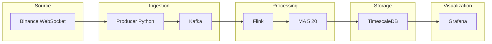

# Real-time Crypto/Stock Pipeline

Real-time price data pipeline: ingest from Binance, stream through Kafka, compute Moving Average (MA) on the stream with Flink, store in TimescaleDB, and visualize in Grafana.

---

## System architecture

### Overview

```
Binance WebSocket  →  Producer (Python)  →  Kafka  →  Flink (MA)  →  TimescaleDB  →  Grafana
```



### Data flow

1. **Producer** connects to Binance WebSocket, receives ticker (price, volume) → normalizes to JSON → publishes to Kafka topic `price-ticks`.
2. **Flink job** reads `price-ticks`, keys by symbol, keeps the last 20 prices in state → on each event computes MA(5) and MA(20) → writes to table `price_ticks` (TimescaleDB).
3. **Grafana** connects to TimescaleDB; dashboard shows price + MA(5) + MA(20) + volume by symbol and time range.

### Tech stack

| Layer       | Technology |
|------------|------------|
| Source     | Binance WebSocket API |
| Queue      | Apache Kafka (topic `price-ticks`) |
| Stream processing | Apache Flink 1.18 (KeyedProcessFunction, JDBC Sink) |
| Storage    | TimescaleDB (PostgreSQL, hypertable) |
| Dashboard  | Grafana (PostgreSQL datasource) |
| Producer   | Python (websocket-client, confluent-kafka) |

### Directory structure

```
project/
├── docker-compose.yml     # Zookeeper, Kafka, TimescaleDB, Grafana, Producer
├── producer/              # Python: Binance WS → Kafka
│   ├── Dockerfile
│   ├── requirements.txt
│   └── src/
│       ├── main.py
│       ├── fetcher/       # Binance WebSocket
│       └── publisher/    # Kafka producer
├── stream-processor/      # Flink job (Java): Kafka → MA → TimescaleDB
│   ├── pom.xml
│   └── src/main/java/com/pipeline/jobs/
│       ├── MovingAverageJob.java
│       ├── MovingAverageFunction.java
│       ├── PriceTick.java
│       └── PriceWithMA.java
├── storage/init/          # DB schema (runs on container startup)
│   └── 01_schema.sql
├── grafana/provisioning/  # Datasource + dashboard
│   ├── datasources/
│   └── dashboards/
├── ARCHITECTURE.md        # Detailed architecture (diagrams, deployment)
└── README.md
```

---

## System requirements

| Component | Notes |
|-----------|--------|
| **Docker + Docker Compose** | Required to run Kafka, TimescaleDB, Grafana, Producer. |
| **Java 17** | Required to build and run the Flink JAR (stream-processor). |
| **Maven** | Required to build: `mvn clean package -DskipTests`. |

**Quick install (macOS, Homebrew):**

```bash
brew install openjdk@17
echo 'export PATH="/opt/homebrew/opt/openjdk@17/bin:$PATH"' >> ~/.zshrc
source ~/.zshrc
brew install maven
```

*(If running the Producer on the host instead of Docker: Python 3 and `brew install librdkafka` are required.)*

---

## Usage

### Step 1 — Start infrastructure

From the project root (where `docker-compose.yml` is):

```bash
cd /path/to/project
docker compose up -d
```

Wait for services to become healthy. Topic `price-ticks` is created automatically.

### Step 2 — Run Producer (Binance → Kafka)

**Option 1 — Docker (recommended):**

```bash
docker compose up -d producer
```

**Option 2 — On host:** Install `librdkafka` (macOS: `brew install librdkafka`), then:

```bash
cd producer
pip install -r requirements.txt
SYMBOLS=btcusdt,ethusdt KAFKA_BOOTSTRAP=localhost:9092 python src/main.py
```

You can change the symbol list in `docker-compose.yml` (service `producer` → `environment.SYMBOLS`).

### Step 3 — Build and run Flink job (Kafka → MA → TimescaleDB)

```bash
cd stream-processor
mvn clean package -DskipTests
```

Set environment variables and run the JAR:

```bash
export KAFKA_BOOTSTRAP=localhost:9092
export JDBC_URL=jdbc:postgresql://localhost:5432/pipeline
export JDBC_USER=pipeline
export JDBC_PASSWORD=pipeline_secret
java -jar target/stream-processor-1.0-SNAPSHOT.jar
```

The job runs continuously: reads from Kafka → computes MA(5), MA(20) → writes to TimescaleDB.

### Step 4 — View Grafana dashboard

1. Open **http://localhost:3000**
2. Log in: **admin** / **admin**
3. Go to **Dashboards** → **Price Pipeline - Real-time**
4. Select **Symbol** (BTCUSDT, ETHUSDT, …) and time range.

---

## Environment variables

| Variable | Description | Default |
|----------|-------------|---------|
| `SYMBOLS` | Binance pairs (e.g. btcusdt,ethusdt,solusdt,...) | btcusdt, ethusdt, bnb, sol, xrp, ada, doge, dot, avax, link |
| `KAFKA_BOOTSTRAP` | Kafka brokers | localhost:9092 |
| `KAFKA_TOPIC` | Raw ticks topic | price-ticks |
| `JDBC_URL` | TimescaleDB URL (Flink) | jdbc:postgresql://localhost:5432/pipeline |
| `JDBC_USER` | DB user | pipeline |
| `JDBC_PASSWORD` | DB password | pipeline_secret |

---

## Default passwords

Defined in `docker-compose.yml`:

| Service | User | Password |
|---------|------|----------|
| **TimescaleDB** | pipeline | pipeline_secret |
| **Grafana (web)** | admin | admin |

When running the Flink job, use `JDBC_USER=pipeline` and `JDBC_PASSWORD=pipeline_secret` (same as TimescaleDB).

---

## Deployment (Docker)

| Service | Port (host) | Notes |
|---------|-------------|-------|
| Zookeeper | 2181 | Kafka coordination |
| Kafka | 9092 | Broker (topic `price-ticks`) |
| TimescaleDB | 5432 | DB `pipeline`, user `pipeline` |
| Grafana | 3000 | Dashboard |

Producer and Flink run in Docker (producer) or on the host (Flink JAR), connecting to Kafka at `localhost:9092` and TimescaleDB at `localhost:5432`.

---

## Pushing to GitHub

From the project root:

```bash
git init
git add .
git commit -m "Initial commit: real-time crypto pipeline (Binance, Kafka, Flink, TimescaleDB, Grafana)"
git branch -M main
git remote add origin https://github.com/YOUR_USERNAME/YOUR_REPO.git
git push -u origin main
```

Replace `YOUR_USERNAME` and `YOUR_REPO` with your GitHub username and repository name. If the repo already exists on GitHub, create it first (empty, no README), then run the commands above.

---

## Further documentation

- **ARCHITECTURE.md** — Detailed diagrams, data flow, layer breakdown, extension ideas.
